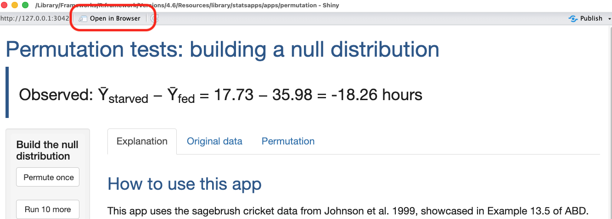
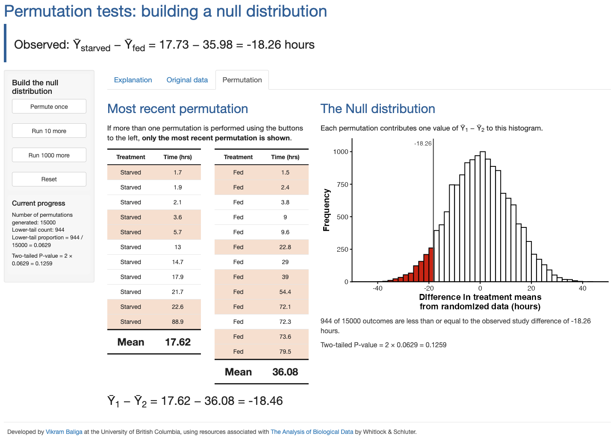

# statsapps

<!-- badges: start -->

<!-- badges: end -->

The `statsapps` R package features interactive `Shiny` apps to help you
learn concepts from data science & statistics.

## Installation

You can install the development version of `statsapps` from [this GitHub
repo](https://github.com/vbaliga/statsapps) with:

``` r
# install.packages("pak")
pak::pak("vbaliga/statsapps")
```

## Example

All apps can be started via functions from `statsapps`. Each app can be
started using a function that begins with `run_`. For example, use
`run_permutation_app()` to start the Shiny app for the Permutation Test.

``` r
library(statsapps)
run_permutation_app()
```

<br>

This will open a new window with the Shiny app. It is recommended to hit
the “Open in Browser” button at the top to get the best view of the app.
This will open the app in your default web browser.

<p align="center">


</p>

The example we showcase here is the Permutation Test app, demonstrates
how repeated random reassignment of observations can be used to build a
null distribution for a two-sample permutation test. As with all
`statsapps`, this app is interactive and allows you to see the results
of individual permutations, and how the result of each permutation
incrementally builds the null distribution.

There are several tabs within the main window of the app. The first two
tabs provide an explanation and the original data. The third tab shows
the results of performing permutations. The buttons in the left sidebar
allow you to perform permutations and visualize the outcome of the most
recent permutation.

<p align="center">


</p>

<hr>

## Contributing and/or raising Issues

Feedback on bugs, improvements, and/or feature requests are all welcome.
Please see the Issues templates on GitHub to make a bug fix request or
feature request.

## Citation

TBD

## License

See LICENSE file (MIT)

🐢
